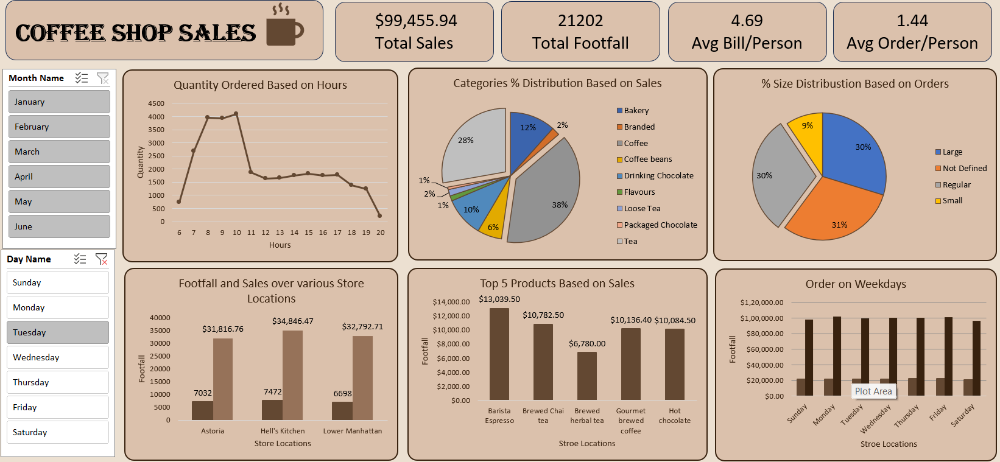

# coffee-shop-sales-analysis
- Coffee Shop Sales Analysis using Excel. The coffee shop lacks clarity on: - Which products generate the most revenue - Peak sales hours and customer demand patterns - Underperforming products - Sales trends across time 

# ☕ Coffee Shop Sales Analysis (Excel)

## Project Overview
This project analyzes coffee shop sales data to understand customer behavior, product performance, and revenue trends.

The goal is to extract meaningful insights that can help improve sales strategies, optimize operations, and enhance customer experience.

## 🎯 Business Problem
The coffee shop lacks clarity on:
- Which products generate the most revenue  
- Peak sales hours and customer demand patterns  
- Underperforming products  
- Sales trends across time  

This leads to inefficient decision-making and missed growth opportunities

## 🎯 Objective
- Analyze overall sales performance  
- Identify top and bottom selling products  
- Understand customer purchasing behavior  
- Provide actionable business recommendations  

## Tools & Technologies
- Excel -> Dashboard Visualization
- CSV/Excel → Data Source 

## 🧹 Data Cleaning & Preparation
- Handled missing/null values  
- Removed inconsistent records  
- Formatted date and time columns  
- Created derived fields (hour, day, category) 

## 📊 Exploratory Data Analysis (EDA)

## Key Analysis:
- Total Revenue & Orders  
- Sales by Product Category  
- Hourly Sales Trends  
- Top & Bottom Products  
- Average Order Value  

## 📈 Key Insights

- ☕ Peak sales occur during morning and evening hours  
- 📊 A few products contribute most of the revenue  
- 📉 Some items consistently underperform  
- 📅 Weekends have higher sales compared to weekdays  
- 💰 Larger orders significantly increase revenue  

## Issues Identified
- Low-performing products affecting profitability  
- High demand during peak hours causing delays  
- Lack of targeted promotions  
- Uneven sales distribution  

## Recommendations
- Promote high-performing products  
- Remove or improve low-performing items  
- Optimize staff during peak hours  
- Introduce combo offers and discounts  

## 📊 Dashboard Features
- KPI Cards (Revenue, Orders, Quantity)  
- Time-based Sales Trends  
- Category-wise Analysis  
- Top/Bottom Products  
- Interactive Filters  

## 📈 Outcome
This project demonstrates the ability to perform end-to-end data analysis and generate actionable insights for business growth.

## Future Scope
- Sales forecasting  
- Customer segmentation  
- Real-time dashboard integration  

## Conclusion
This analysis highlights how data-driven insights can help improve decision-making, increase revenue, and optimize operations in a coffee shop business.
